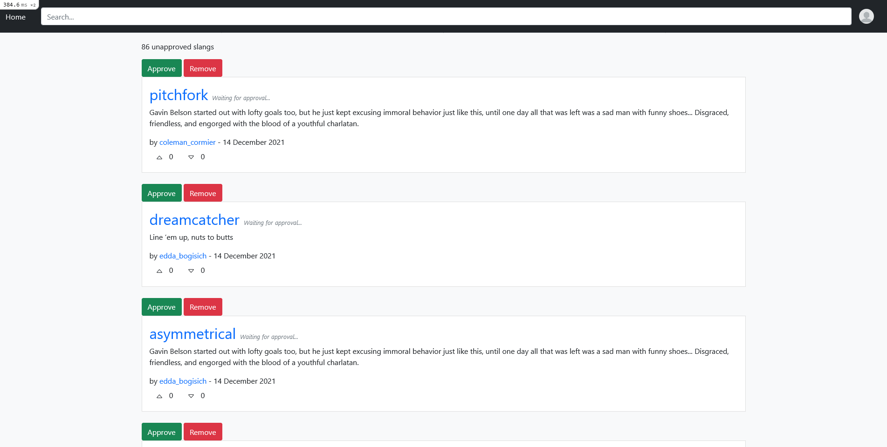

# Slang Dictionary


## Description

This is a demo application quickly built to replicate Urban Dictionary. My second Ruby on Rails application, there's definitely room for improvement.

Styling also wasn't the main focus of this demo. The views are using Bootstrap to make building the application faster. The main reason for the application was to test and learn Ruby on Rails.

**Not recommended for deployment**

## Dependencies

This application requires:

* Ruby 3.0.3
* Rails 6.1.4.1

How to install [Ruby on Rails](https://www.youtube.com/watch?v=3D9d0wmwHVQ).

## Configure Application

```
bundle install
```

```
yarn
```

## Create Demo DB

```
rails db:create
```
```
rails db:migrate
```
The following command creates demo data in the DB
```
rails db:seed
```

## Start Rails Server

```
rails s
```

## Admin Account

The following details for the admin account is only available when you've finished seeding the database.

Email: `admin@fake.com`  
Password: `password`

## Images

Home


Your profile, unapproved slangs are limited to your own profile and admins.


Random user profile


Adding new slang


Admin view for approval



